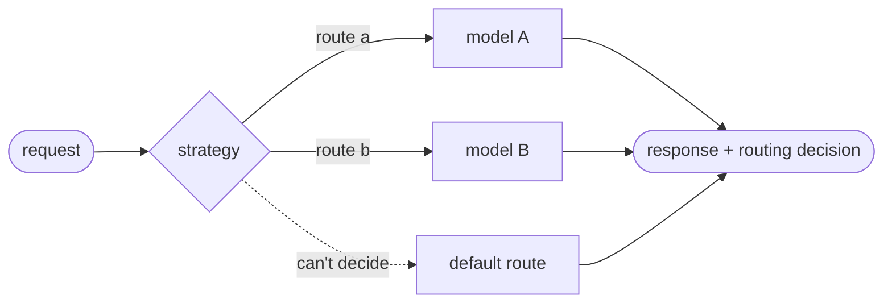

# langchain-llm-router

[](LICENSE)
[](pyproject.toml)
[](https://docs.langchain.com/oss/python/langchain/overview)

**Send each request to the right model, by rules you control, from one LangChain chat model.**

`ChatRouter` is a drop-in LangChain chat model. You give it a few named models and a **strategy**.
For each request, the strategy picks one of the models. The router returns that model's own
response, along with a note of which model answered and why.

What "the right model" means is up to you:

- **Difficulty:** a fast model for easy requests and a frontier model for hard ones.
- **Topic:** code questions to a coding model, and legal questions to a model tuned for them.
- **Content:** requests with images or documents to a model that can read them.
- **Data:** requests that touch sensitive data to a model you host yourself.
- **Customer or experiment:** each plan or A/B test group to its own model.

Whatever the policy, the router behaves the same way:

- **Nothing else to change.** It is a chat model, so `invoke`, `stream`, `batch`, tools, structured
  output, agents and LangGraph all work unchanged.
- **Routing you can read.** Every response records the route and the reason, such as
  `matched keyword 'regex'` or `difficulty 1.50 >= 1.00 (code 1.00, analysis 0.50)`. The same
  record appears in your LangSmith trace.
- **Always answers.** If the strategy can't decide, the default model answers and you get a
  warning.
- **Nothing extra to run.** No proxy, no service and no API key of its own. It needs only
  `langchain-core`.

## Get started

```bash
pip install langchain-llm-router
```

A route can be any LangChain chat model (a `BaseChatModel`) from any
[provider](https://docs.langchain.com/oss/python/integrations/chat), hosted or local. This first
router routes on difficulty, with two routes: a small model and a frontier one. Its
`HeuristicStrategy` scores how hard each request looks. Requests that score low go to the first
tier, and the rest go to the second.

```python
from langchain.chat_models import init_chat_model

from langchain_llm_router import ChatRouter, HeuristicStrategy, routing_decision

router = ChatRouter(
    routes={
        "small": init_chat_model("google_genai:gemini-3.5-flash-lite"),
        "frontier": init_chat_model("google_genai:gemini-3.8-flash"),
    },
    default_route="small",
    strategy=HeuristicStrategy("small", "frontier"),  # tiers, cheapest first
)

for question in [
    "What's the capital of France?",
    "Compare the trade-offs of quicksort and mergesort on linked lists.",
]:
    response = router.invoke(question)
    decision = routing_decision(response)
    print(f"{decision.route:<8} {decision.reason}")
```

```text
small    difficulty 0.00 < 1.00 (no signal fired)
frontier difficulty 1.00 >= 1.00 (analysis 1.00)
```

The first question shows no sign of difficulty, so the small model answered it. The second asks
for a comparison and its trade-offs. Those are two reasoning words, which gives a score of 1.00,
the default bar for the frontier tier.

`response` is the chosen model's own `AIMessage`, so `response.text`, `response.tool_calls` and
`response.usage_metadata` are exactly what that model returned. The routing decision is in
`response.response_metadata["routing"]`, and `routing_decision(response)` reads it for you.

## How it works



1. The strategy looks at the **current request**, meaning the user's latest message. It ignores
   tool output and the rest of the conversation, so an agent's tool loop can't change the route.
2. It names a route and gives a reason, or it abstains. If it abstains, the default route answers.
3. The router calls that one model and returns its response, with the routing decision attached.

## Choose a strategy

| Strategy | Decides by | Extra cost per request | Good for |
| --- | --- | --- | --- |
| [`HeuristicStrategy`](docs/strategies.md#heuristicstrategy-route-on-difficulty) | A difficulty score: length, code, several questions, reasoning words, images | None | Cheap model for easy requests, strong model for hard ones |
| [`KeywordStrategy`](docs/strategies.md#keywordstrategy-route-on-words) | Words in the request | None | Topics with telltale words, such as "SQL" or "invoice" |
| [`ConfigurableStrategy`](docs/strategies.md#configurablestrategy-combine-rules) | Your rules, combining keywords, scores, media and tools | None | A policy with several conditions |
| [`EmbeddingStrategy`](docs/strategies.md#embeddingstrategy-route-on-meaning) | Similarity to example requests | One embedding call | Topics without telltale words |
| [`ClassifierStrategy`](docs/strategies.md#classifierstrategy-let-a-small-model-choose) | A small model reads route descriptions and picks one | One small-model call | Subtle distinctions, when accuracy matters most |
| [Your own function](docs/strategies.md#your-own-strategy) | Your code | Whatever your code costs | Business rules, an existing classifier |

Start with a strategy that makes no extra call. Reach for embeddings or a classifier when words and
rules can't tell your routes apart. They read meaning, but they add a call to every request.

## Documentation

- **[Routing strategies](docs/strategies.md)** covers how each strategy decides, with examples,
  tuning and how to write your own.
- **[Using the router](docs/guide.md)** covers reading the decision, streaming, tools, structured
  output, agents, forcing a route for A/B tests, tracing and cost, retries and caching.
- **[Examples](examples/README.md)** has one runnable script per use case. They use fake models,
  so they run offline.
- **[Benchmark](benchmark/README.md)** compares the strategies on cost and answer quality over a
  mixed workload, and shows how to rerun it with your own models.
- **[Design notes](docs/design.md)** explain why the router is built the way it is. Read these
  before contributing.

## Scope

The router picks one model **before** the call, using a policy you define. It doesn't learn from
traffic, retry a weak answer on a stronger model, spend against a budget, or run as a proxy.
Inside `create_agent`, a choice that depends on agent state belongs in
[`@wrap_model_call` middleware](https://docs.langchain.com/oss/python/langchain/middleware), which
can use the router as its model.

> [!TIP]
> **Provider prompt caching.** Moving a conversation between models loses the prompt prefix that
> the provider has cached. For long conversations, you can
> [keep each conversation on one route](docs/strategies.md#a-strategy-class).

## Contributing

Development uses [uv](https://docs.astral.sh/uv/) (Python 3.12; the package supports 3.10+):

```bash
uv sync
uv run pytest
uv run ruff check . && uv run ruff format --check . && uv run mypy
```

See [AGENTS.md](AGENTS.md) for the repository layout and conventions, and
[GitHub Issues](https://github.com/danielpolok/langchain-llm-router/issues) for open work.

## License

[MIT](LICENSE)
